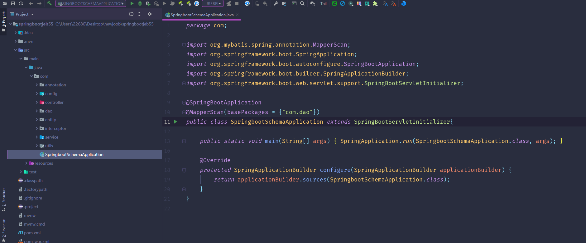
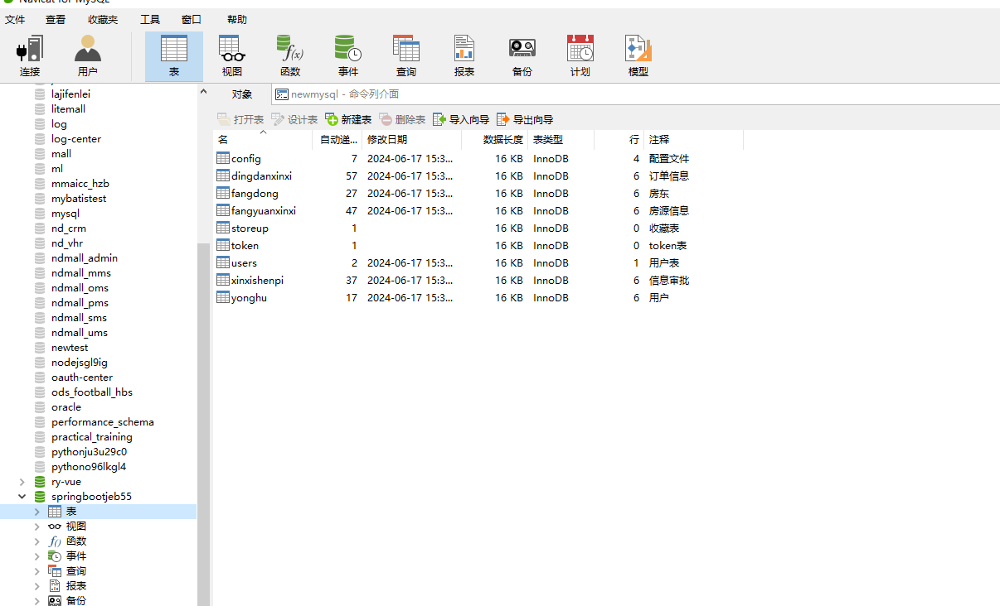
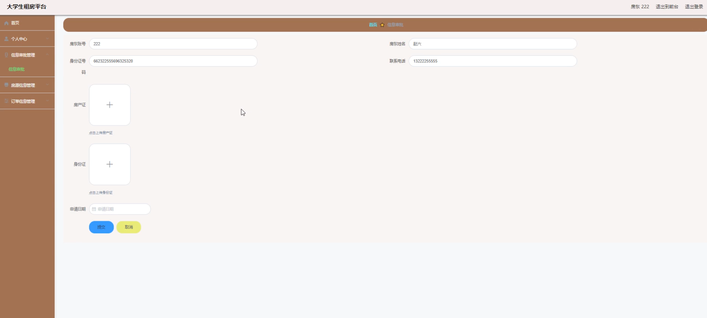
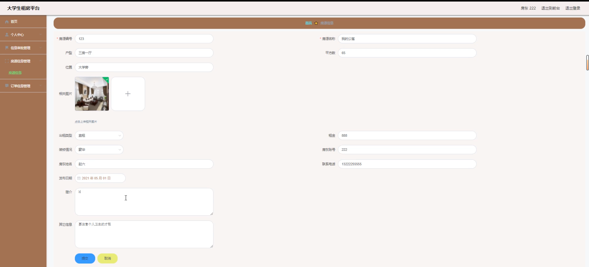
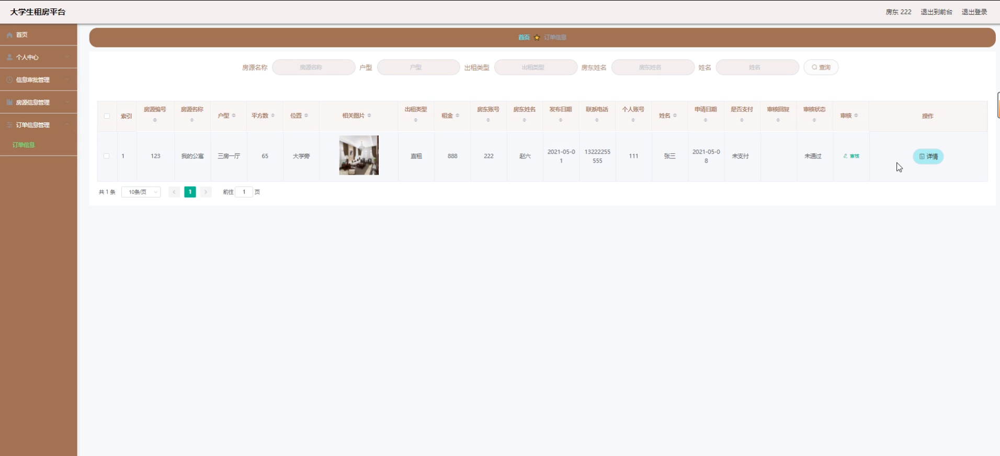
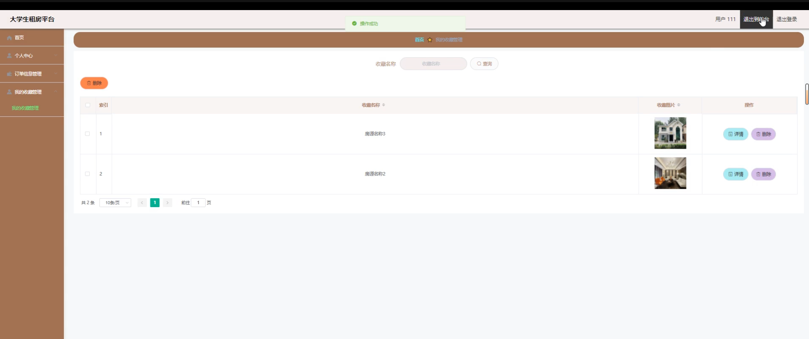
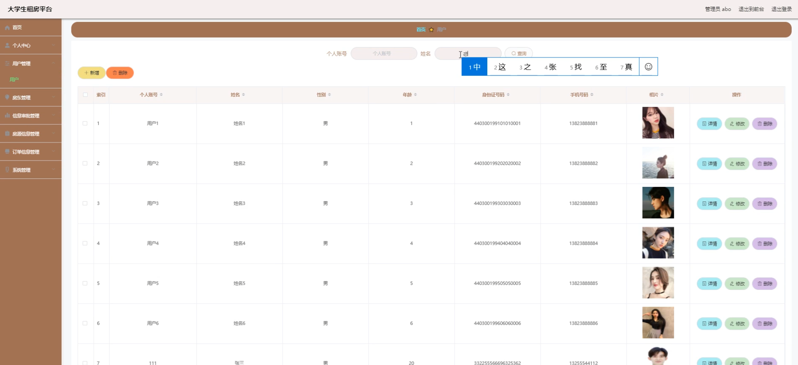
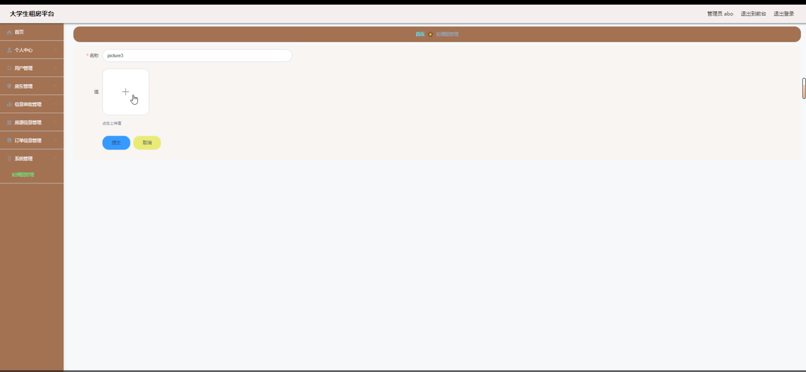

# 大学生租房平台的设计与实现

#### 介绍

本大学生租房平台旨在解决大学生租房难题，提供一个安全、便捷、透明的租房环境。平台主要面向大学生群体，通过信息化手段，简化租房流程，提高租房效率，增强租房体验。系统设有三种角色：管理端、用户端和房东端，各角色分别拥有不同的功能模块，满足各自的需求和职责。

#### 技术栈介绍

后端技术栈：Springboot+Mysql+Maven

前端技术栈：Vue+Html+Css+Javascript+ElementUI

开发工具：Idea+Vscode+Navicate

#### 功能模块介绍

一、管理端

管理端是系统的核心，负责整个平台的运营和维护。其主要功能模块包括：

个人中心：管理员可以查看和修改自己的个人信息，如姓名、联系方式等。

用户管理：管理员可以管理所有注册用户的账号信息，包括查看、编辑、禁用或删除用户账号。

房东管理：类似于用户管理，但专注于房东账号的管理，确保房东信息的真实性和有效性。

信息审批管理：对房东发布的房源信息进行审核，确保房源信息的真实性和合规性。

房源信息管理：查看、编辑或删除所有房源信息，确保平台上的房源信息保持最新和准确。

订单信息管理：查看和管理所有租房订单，包括订单的创建、修改、取消和完成等。

系统管理：配置系统参数，如网站设置、权限管理等，以确保系统的正常运行。

二、房东端

房东端为房东提供了房源发布和管理的功能，使房东能够轻松地在平台上发布和管理自己的房源。其主要功能模块包括：

房源信息：房东可以发布新的房源信息，包括房源描述、价格、地理位置、图片等，并可以查看和编辑已发布的房源信息。

个人中心：房东可以查看和修改自己的个人信息，如姓名、联系方式、银行卡信息等。

后台管理：

信息审批管理：查看自己发布的房源信息的审批状态，以及未通过审批的原因。

房源信息管理：除了发布和编辑房源信息外，房东还可以下架或删除不再出租的房源。

订单信息管理：查看和管理与房源相关的租房订单，包括与租客的沟通和订单状态的更新。

三、用户端

用户端主要面向大学生，为他们提供了浏览房源、预订房源以及管理个人信息的功能。其主要功能模块包括：

房源信息：用户可以浏览所有已发布的房源信息，按照价格、地理位置等条件进行筛选，并查看房源的详细信息和图片。

个人中心：用户可以查看和修改自己的个人信息，如姓名、联系方式、学校等。

后台管理：

订单信息管理：用户可以查看和管理自己的租房订单，包括订单的创建、支付、取消和评价等。

我的收藏管理：用户可以收藏感兴趣的房源，方便日后查看和比较。

#### 系统功能截图

代码结构

数据库表

登录

首页

个人中心

房源信息

信息审批

房源信息

订单信息管理

我的收藏管理

用户管理

系统管理

#### 总结

大学生租房平台通过现代化的技术手段，为大学生群体提供了一个便捷、安全的租房环境，解决了传统租房过程中信息不对称、交易不透明的问题。平台不仅提升了租房效率，还为房东和管理员提供了高效的管理工具，打造了一个可信赖的租房生态系统。通过信息化的管理和操作，平台实现了租房过程的透明化和标准化，为大学生群体带来了极大的便利和保障，同时也为房东提供了有效的房源管理途径，促进了租房市场的健康发展。

#### 使用说明

创建数据库，执行数据库脚本 修改jdbc数据库连接参数 下载安装maven依赖jar 启动idea中的springboot项目

后台地址：http://localhost:8080/springbootjeb55/admin/dist/index.html

管理员  abo 密码 abo

前台地址：http://localhost:8080/springbootjeb55/front/index.html
